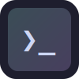

# Pulse

<p align="center">
  
</p>

<h3 align="center">A blazing fast terminal emulator with glass aesthetics</h3>

<p align="center">
  Built with Rust + Tauri for native performance, React + TypeScript for modern UI,
  and GPU-accelerated rendering for smooth visuals.
</p>

---

## Features

### Glass Aesthetics
- Frosted glass window with real-time blur
- Noise texture overlay for depth
- Shimmer animation effects
- Customizable opacity (0-100%)
- Drop shadows with configurable intensity

### Multiplexing
- **Multiple tabs** - Run separate sessions in each tab
- **Split panes** - Divide terminals horizontally or vertically
- **Recursive splits** - Create complex layouts
- **Drag resize** - Adjust pane sizes with mouse

### Performance
- **GPU-accelerated** - WebGL text rendering via xterm.js
- **Native backend** - Rust PTY management with zero-copy I/O
- **120fps animations** - GPU-composited transitions
- **Low memory** - Tauri's minimal footprint

### Customization
- **6 built-in themes** - Catppuccin, Dracula, Tokyo Night, Nord, Gruvbox
- **Full theme editor** - Colors, fonts, glass effects
- **Custom keybindings** - Terminator-compatible defaults
- **Live preview** - See changes before applying

## Screenshots

<p align="center">
  <em>Dark mode with Catppuccin Mocha theme</em>
</p>

```
┌─────────────────────────────────────────────────────────┐
│  ● ● ●                                    Pulse         │
├──────────────┬──────────────────────────────────────────┤
│ Shell 1  ×   │ Shell 2  ×        +                      │
├──────────────┼──────────────────────────────────────────┤
│              │                                          │
│  (clumzzy)   │  (clumzzy) in ~/projects                 │
│  in ~/code   │  on main ✓                               │
│              │                                          │
│  ➤ ls -la    │  ➤ cargo build                           │
│  total 32    │     Compiling pulse v0.1.0               │
│  drwxr-xr-x  │     Finished release [optimized]        │
│              │                                          │
└──────────────┴──────────────────────────────────────────┘
```

## Installation

### Arch Linux

```bash
# Install dependencies
sudo pacman -S --needed curl git nodejs npm rust base-devel wget file webkit2gtk-4.1 gtk3 libayatana-appindicator librsvg openssl

# Install Pulse
curl -sSL https://raw.githubusercontent.com/0xClumzzy/pulse/main/install.sh | bash
```

### Debian / Ubuntu

```bash
# Install dependencies
sudo apt install curl git nodejs npm rustc cargo build-essential libwebkit2gtk-4.1-dev libgtk-3-dev libayatana-appindicator3-dev librsvg2-dev libssl-dev

# Option 1: Install script
curl -sSL https://raw.githubusercontent.com/0xClumzzy/pulse/main/install.sh | bash

# Option 2: Binary download
wget https://github.com/0xClumzzy/pulse/releases/download/v0.1.0/pulse-x86_64
chmod +x pulse-x86_64
sudo mv pulse-x86_64 /usr/local/bin/pulse

# Option 3: .deb package
wget https://github.com/0xClumzzy/pulse/releases/download/v0.1.0/pulse_0.1.0_amd64.deb
sudo dpkg -i pulse_0.1.0_amd64.deb
```

### Fedora / RHEL

```bash
# Install dependencies
sudo dnf install curl git nodejs npm rust cargo webkit2gtk4.1-devel gtk3-devel libappindicator-gtk3-devel librsvg2-devel openssl-devel

# Option 1: Install script
curl -sSL https://raw.githubusercontent.com/0xClumzzy/pulse/main/install.sh | bash

# Option 2: Binary download
wget https://github.com/0xClumzzy/pulse/releases/download/v0.1.0/pulse-x86_64
chmod +x pulse-x86_64
sudo mv pulse-x86_64 /usr/local/bin/pulse

# Option 3: .rpm package
wget https://github.com/0xClumzzy/pulse/releases/download/v0.1.0/pulse-0.1.0-1.x86_64.rpm
sudo rpm -i pulse-0.1.0-1.x86_64.rpm
```

### Other Distros

Build from source. See [docs/BUILDING.md](docs/BUILDING.md) for details.

### Uninstall

```bash
rm ~/.local/bin/pulse
```

## Documentation

| Document | Description |
|----------|-------------|
| [Installation](docs/INSTALL.md) | Platform-specific install guides |
| [Building](docs/BUILDING.md) | Build from source instructions |
| [Keybindings](docs/KEYBINDINGS.md) | Complete keyboard shortcut reference |
| [Themes](docs/THEMES.md) | Theme system and custom themes |
| [Configuration](docs/CONFIGURATION.md) | All configuration options |
| [Contributing](CONTRIBUTING.md) | How to contribute |

## Keyboard Shortcuts

### Tabs
| Action | Shortcut |
|--------|----------|
| New Tab | `Ctrl+Shift+T` |
| Close Tab | `Ctrl+Shift+W` |
| Next Tab | `Ctrl+PageDown` |
| Previous Tab | `Ctrl+PageUp` |
| Go to Tab 1-9 | `Ctrl+Alt+1-9` |

### Split Panes
| Action | Shortcut |
|--------|----------|
| Split Vertically | `Ctrl+Shift+E` |
| Split Horizontally | `Ctrl+Shift+O` |
| Close Pane | `Ctrl+Shift+X` |
| Navigate Panes | `Ctrl+Shift+Arrow` |
| Resize Panes | `Ctrl+Shift+Alt+Arrow` |

### General
| Action | Shortcut |
|--------|----------|
| Command Palette | `Ctrl+Shift+P` |
| Search | `Ctrl+Shift+F` |
| Settings | `Ctrl+Shift+,` |
| Copy | `Ctrl+Shift+C` |
| Paste | `Ctrl+Shift+V` |
| Zoom In | `Ctrl++` |
| Zoom Out | `Ctrl+-` |
| Reset Zoom | `Ctrl+0` |

See [docs/KEYBINDINGS.md](docs/KEYBINDINGS.md) for all shortcuts.

## Themes

| Theme | Variant | Preview |
|-------|---------|---------|
| Catppuccin Mocha | Dark | `#1e1e2e` background |
| Catppuccin Latte | Light | `#eff1f5` background |
| Dracula | Dark | `#282a36` background |
| Tokyo Night | Dark | `#1a1b26` background |
| Nord | Dark | `#2e3440` background |
| Gruvbox Dark | Dark | `#282828` background |

See [docs/THEMES.md](docs/THEMES.md) for creating custom themes.

## Built With

- [Tauri](https://tauri.app/) - Desktop framework
- [Rust](https://www.rust-lang.org/) - Systems language
- [React](https://react.dev/) - UI library
- [xterm.js](https://xtermjs.org/) - Terminal emulator
- [Framer Motion](https://www.framer.com/motion/) - Animations

## Roadmap

- [ ] Sixel graphics support
- [ ] SSH integration
- [ ] Session persistence
- [ ] Custom shaders
- [ ] Plugin system

## License

MIT License - see [LICENSE](LICENSE) for details.

## Acknowledgments

- Inspired by [Terminator](https://gnome-terminator.org/), [Alacritty](https://alacritty.org/), and [WezTerm](https://wezfurlong.org/wezterm/)
- Theme colors from [Catppuccin](https://catppuccin.com/)
